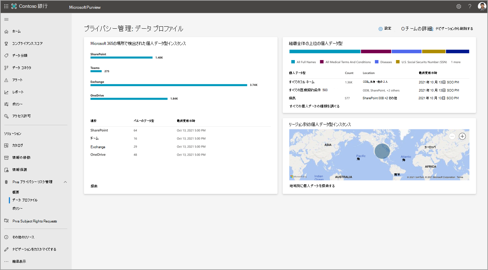

# Microsoft Privaで個人データを検索して視覚化する

Microsoft Privaは、個人データ資産の検出を自動化し、重要な情報の視覚化を提供することで、組織が格納するデータを理解するのに役立ちます。 これらの視覚化は、 **概要** ページと **データ プロファイル** ページにあります。 ここでの分析情報に基づいて、組織のプライバシー体制を強化し、リスクを軽減することができます。

まず、[Microsoft Purview コンプライアンス ポータル](https://compliance.microsoft.com/)の [Priva] セクションに移動し、次のページを表示します。

- **概要**: Microsoft 365内の組織のデータに対する全体的なビューを提供します。 プライバシー管理者は、傾向とアクティビティを監視し、個人データに関連する潜在的なリスクを特定して調査し、ポリシー管理やサブジェクトの権利要求アクションなどの主要なアクティビティに取り組むことができます。
- **データ プロファイル**: 組織がMicrosoft 365に保存する個人データのスナップショットを提供します。 このページは、個人データの場所、組織内で最も一般的な種類、Microsoft 365環境内の場所に存在するさまざまな種類の数を視覚化するのに役立ちます。 この場所から個人データを探索することもできます。

データが変更され、Privaによって新しい結果が得られ、これらのページに表示される情報が更新されます。 新しいデータがグラフに表示されるまでに最大で 24 時間かかる場合があることに注意してください。

## 概要ページを確認する

**Privaの概要** ページは、すべてのPrivaユーザーが利用できます。 次に示すページは、主に次の 3 つのセクションで構成されています。

1. ページの上部にある[タイル](#top-tiles)は、データに関する基本的な最近の統計情報を提供します。 
2. [[Key insights]](#key-insights) セクションでは、主な関心のある傾向と領域に関する調査の機会を提供します。
3. [近似曲線グラフは、](#trendline-graphs)データ環境に関する追加のパースペクティブを提供します。

**Priva概要ページ:**

### トップ タイル

#### 過去 7 日間のポリシーの一致

Priva プライバシー リスク管理内にポリシーが設定されている場合、プライバシー リスクが発生する可能性がある特定の条件について、ポリシーに基づいてデータが評価されます。 ポリシーの一致は、さらに確認または修復が必要になる可能性があるデータ検出を示します。 このタイルは、過去 7 日以内に発生したポリシー一致の数を示します。 ポリシーがオンかテスト モードで実行されているかに関係なく、ここで一致が表示されるので、アクティブなすべてのポリシーの結果を確認できます。 このタイルを選択すると、プライバシー リスク管理の **[ポリシー** ] ページのフィルター処理されたビューに移動し、過去 7 日以内に一致したポリシーが表示されます。

#### 個人データを含むアイテム

Privaの自動検出機能を職場で確認するには、[**アイテムと個人データ**] タイルを確認します。 このタイルは、過去 7 日間に組織のMicrosoft 365環境で、設定に基づいて個人データを含む新しいアイテムの数を示します。 このタイルを選択すると、検出された最新の 100 個のアイテムのビューが読み込まれます。

#### サブジェクトの権利要求

概要ページには、過去 7 日間に作成されたサブジェクト権限要求の数を示すタイルが含まれています。 2 つ目のタイル (該当する場合) は、指定された期限に基づいて期限切れの要求の数を示し、すぐに注意が必要になる場合があります。 これらのタイルを選択すると、適切なアクセス許可を持つユーザーがメインの [サブジェクト権利] ページに移動します。

### 主な分析情報

#### 個人データが最も多いコンテンツ アイテム

大量の個人データを含むコンテンツは、漏洩のリスクが高くなる可能性があります。 このような項目を確認して、プライバシー リスク管理ポリシーの対象であることを確認することもできます。 これらの項目を注意を引くために、概要ページには、設定に従って最も個人データが含まれるコンテンツ アイテムのビューが表示されます。 ここでは、検出された一意の個人データの種類の数、特定された一意のコンテンツ所有者の数、およびサブジェクト権利要求のデータ照合設定に従って識別されたデータ 主体の数を確認できます。

見つかったアイテム **の概要** ビューで [概要の表示] を選択します。 これらの結果を **調べて** 、個々のファイルをプレビューすることもできます。 このビューには、最大 100 個のアイテムが表示されます。 Privacy Management ロール グループのユーザーは、ファイルを選択して詳細を確認し、関連性を判断し、参照用にリスト.csvエクスポートできます。

#### 過去 1 週間で最も一致するポリシー

この分析情報は、"オン" モードでも "テスト中" でも、過去 7 日間に最も頻繁に一致したポリシーを示します。 これは、ポリシーのパフォーマンスと、Priva ユーザーがプライバシーの動作を改善するための継続的な作業の影響を示すのに役立ちます。

一致した上位 10 個のポリシーと、関連付けられているコンテンツのコンテンツ所有者の概要を表示する場合は、[ **概要の表示** ] を選択します。 また、これらのポリシーが一致したために送信されたユーザー通知の数と、実行されたユーザー アクションの数も表示されます。 [ **調査** ] を選択すると、[プライバシー リスク管理] の [ポリシー] ページが表示され、サマリー ビューからポリシーが表示されます。 この調査ビューには、ポリシーの有効期間全体の統計情報が表示されます。 これを選択すると、一致した項目が最初に検出された日時などの詳細が表示されます。

#### 過去 1 週間に一致したポリシーが最も多いユーザー

この分析情報は、"テスト" モードまたは "オン" モードのポリシーからの一致にも対処します。 これにより、過去 1 週間に最も多くのポリシーが一致したユーザーと、一致するポリシーの概要を表示できます。 これには、一意のコンテンツ所有者の合計、これらのユーザーに送信された通知、それらの通知から実行されたアクションの数が含まれます。 [ **調査]** を選択すると、ポリシー ページが表示され、フィルター処理されて、概要ビューからポリシーが表示されます。 調査ビューでは、ユーザー情報は見つかりませんが、ポリシーを選択して、これらの一致に関連するポリシーの詳細を表示できます。

#### データ主体のコンテンツが最も多い項目

この分析情報は、最も多くのデータ主体の個人データを含むコンテンツ 項目を表示します。 これらの分析情報を受け取るには、組織で [サブジェクト権利要求に対してデータ一致を設定する必要があります](subject-rights-requests-data-match.md)。

これらの項目は、データ照合の構成を確認するのに役立ち、これらの項目に関連するプライバシー リスクを軽減するのに役立ちます。 **概要ビューの [ビューの** 概要] を選択します。 これらの項目の最大 100 個の詳細ビューを表示するには、[ **探索** ] を選択します。 ここでは、これらの項目をプレビューし、関連性を判断し、リストを.csv形式でエクスポートできます。

### 近似曲線グラフ

組織のデータに見られる傾向の動的な視覚化については、近似曲線グラフを参照してください。 これらのグラフは、期間、データ型、データの場所などの特性によってフィルター処理できます。 表示を調整するには、指定されたドロップダウンを使用します。 グラフ内の線の上にマウス ポインターを置くと、その特定の時点に関連する統計を表示できます。

ポリシーに関連する結果には、"テスト" モードと "オン" モードの両方のポリシーからのデータが含まれます。 特定の種類のポリシーがアクティブでない場合、関連するグラフに結果は表示されません。

#### アクティブなポリシー アラート

この領域には、ポリシーの一致によってトリガーされたアクティブなアラートのスナップショットが表示されます。 時間の経過と共に、このビューは、ボリュームの大きな急増などの異常をより簡単に検出するのに役立ちます。 [ **アラートの表示** ] を選択してプライバシー リスク管理内のポリシー ページに移動します。そこで、アラートをさらに調査し、修復の問題を作成できます。

#### 組織内で見つかった個人データ

このグラフは、Microsoft 365環境で設定に一致する個人データが時間の経過と共に検出された量と、その場所の傾向を示しています。 Privaが十分な時間実行され、SharePoint、OneDrive、Teams、またはExchange内で個人データのコンテンツが見つかった後に、データの入力が開始されます。

#### 組織内で検出されたデータ転送

このグラフは、データ転送ポリシーに関連しています。 組織内のデータの移動方法を、部門間または複数地域の組織のリージョン間で表示します。

#### 未使用の個人データ

このグラフは、データ最小化ポリシーに関連しています。 これにより、組織が個人データを含むコンテンツを格納する方法と、ポリシーによって時間の経過と共にこのデータの処理がどのように改善されるかについての分析情報が得られます。

#### 露出超過の個人データ

このグラフは、データの露出過剰ポリシーに関連しています。 個人データを含むコンテンツが過度に公開される可能性がある組織や場所内で、時間の経過と共に共有動作を特定するのに役立ちます。たとえば、パブリックに共有される、外部ユーザーと共有する、組織内で広く共有されているなどです。

#### 規制別の主な権利要求

このビューは、対象となる権利要求を時間の経過と共に最も一般的に推進している規制に関する分析情報を提供します。 このグラフの凡例は、傾向のある規制の名前を示しています。 傾向線の上にマウス ポインターを置くと、選択した時間にその規制に対して開かれているサブジェクト権利要求の合計が表示されます。

#### 状態別のサブジェクト権限要求

このグラフは、組織がサブジェクト権限要求を完了する方法を表示します。これは、 **アクティブ**、 **クローズ**、または **期限切れの** 要求に分割されます。 ここでの結果は、要求と会議のターゲットを終了するために、より多くのリソースを割り当てることでメリットを得られる場所を示すのに役立つ場合があります。

### その他のデータ ビュー

#### サブジェクトの権利要求をひと目で確認する

このビューでは、期限までに要求を完了するまでの残り時間など、アクティブなサブジェクト権利要求の概要を示します。 これは、要求の合計数、アクティブな要求の数、およびクローズされた数をまとめたものです。 [ **すべての要求の表示** ] を選択してサブジェクト権限要求ページに移動し、詳細を表示し、アクティブな要求を処理して完了まで進めることができます。

#### 居住地別の主な権利要求

このマップ ビューは、データ 主体の所在地によって、サブジェクト権利要求の量を視覚化するのに役立ちます。 バブルの上にマウスポインターを置くと、リージョンと、そこに住む居住者に代わって開かれたサブジェクトの権利要求の合計が識別されます。

## データ プロファイル ページを調べる

下に表示される **[データ プロファイル]** ページには、組織がMicrosoft 365に保存している個人データとその場所のスナップショット ビューが表示されます。 また、格納するデータの種類に関する分析情報も提供されます。 このページのグラフについては、以下で説明します。

**Priva データ プロファイル ページ:**

### Microsoft 365で検出された個人データ型インスタンス

このタイルは、設定に基づいて、Microsoft 365環境に存在する個人データの量と、そのデータがExchange、OneDrive、SharePoint、およびTeamsに分散される方法を視覚化するのに役立ちます。

棒グラフには、コンテンツ内で見つかった一意の個人データ型インスタンスのおおよその集計数が表示されます。 データ型の例には、クレジット カード番号や社会保障番号などがあります。 したがって、3 つのクレジット カード番号と 1 つの社会保障番号を含む検出されたファイルには、2 つの一意の個人データ型と 4 つのインスタンスが含まれます。 このタイルの下部には、各Microsoft 365場所内の一意の個人データ型が表示されます。 組織のコンテンツで検出された個人データの種類の多様性に関するビューを提供します。

### 組織全体の上位の個人データ型

このタイルには、環境内で検出された上位の個人データ型のスナップショットと、その個人データ型を含むアイテムの数と場所に関する情報が表示されます。

### リージョン別の個人データ型インスタンス

複数地域環境の場合、このタイルは、このコンテンツがホストされているリージョンに基づいて、コンテンツ内で見つかった個人データ型インスタンスを地域的に集計します。 単一リージョンの組織の場合、このタイルには、Microsoft 365の場所を表す 1 つのドットが表示されます。 マップ上のドットの上にマウス ポインターを置くと、そのリージョンで検出された個人データ型インスタンスのおおよその数が表示されます。

### コンテンツの探索

データ プロファイル タイルで **[探索** ] を選択すると、コンテンツ エクスプローラーが開きます。 現時点では、特定のコンテンツ アイテムを検索できず、このビューにTeamsデータは表示されません。 つまり、コンテンツ エクスプローラー内の数値は、データ プロファイル ページにTeamsコンテンツが含まれているため、データ プロファイル ページに表示される数値と一致しない可能性があります。 プライバシー データの詳細を把握したいプライバシー管理者は、個人データの種類 (機密情報の種類) または場所 (Exchange、OneDrive、またはSharePoint) に基づいて、ここで行うことができます。

## 法的免責事項

[Microsoft Priva法的免責事項](priva-disclaimer.md)
