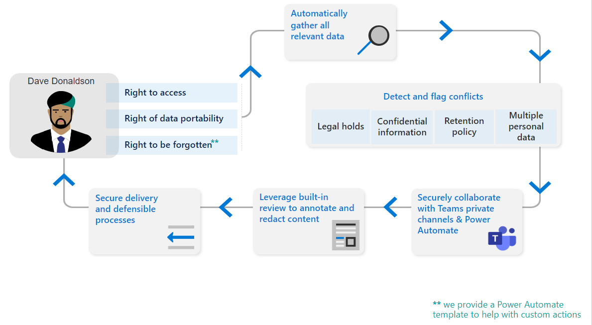

# 試用版プレイブック: Microsoft Priva

Microsoft Priva試用版プレイブックへようこそ。

このプレイブックは、個人データを保護し、プライバシーに回復性のある職場を構築できるようにすることで、90 日間の無料試用版を最大限に活用するのに役立ちます。

Microsoft の推奨事項を使用して、Privaを使用して、データの買いだめ、データ転送、データの過剰共有などのプライバシー リスクを事前に特定して保護し、組織が大規模な件名要求を自動化および管理し、従業員がスマート データ処理の意思決定を行えるように支援する方法について説明します。

## はじめに

*これらのアクションは、90 日間の試用版で試す主な機能に関する推奨事項です。*

前提条件を設定して試用版を開始します。 Privaは、Priva プライバシー リスク管理とPriva 主体の権利要求の 2 つの主要なソリューションで構成されており、個別に試して購入できることに注意してください。 ライセンスと購入の詳細については、Microsoft.com に関するページを [参照](https://www.microsoft.com/security/business/privacy/privacy-management-software?rtc=1#office-ContentAreaHeadingTemplate-8x0pmkp)してください。

### プライバシー リスク管理

**プライバシー リスク管理** ソリューションを使用すると、組織の個人データを保護し、プライバシーに回復性のある職場を構築する方法を調べることができます。

- データの買いだめ、データ転送、データの過剰共有などのプライバシー リスクを事前に特定し、保護する
- 個人データの保存と移動に関する可視性を得る
- 情報ワーカー Microsoft Empower for ISV Initiative、このデータの処理に関するスマートな決定を行う
- ユーザーがデータを効果的に管理し、進化するプライバシー規制に準拠するための手順を実行できるようにする

### サブジェクト権利要求

**Subject Rights Requests** ソリューションを使用すると、最初の要求からレポートの作成までの問い合わせを処理する方法を学習できます。

- サブジェクトの権限要求を大規模に管理する

## Microsoft Priva試用版を開始する

Microsoft Privaの使用を開始する準備ができたら、次の手順に従って前提条件を設定し、プライバシーに関する分析情報の調査を開始します。

1. [サブスクリプションとライセンスを確認する](priva-setup.md#confirm-subscriptions-and-licensing)
1. [ユーザー権限の設定とロールの割り当て](priva-setup.md#set-user-permissions-and-assign-roles)
1. [試用版の開始] を選択すると、次の操作が自動的に行われます。
    - 試用版ライセンスが有効になっているPriva (これはリアルタイムで発生します)
    - プライバシーに関する分析情報が生成されます (これには 24 時間かかります)

## プライバシー リスクの検索と視覚化を開始する

Privaは、個人データ資産の検出を自動化し、重要な情報の視覚化を提供することで、組織が格納するデータを理解するのに役立ちます。

まず、Microsoft Purview コンプライアンス ポータルの [Priva] [セクションに移動](https://compliance.microsoft.com/)し、次のページを表示します。

1. [概要](priva-data-profile.md#explore-the-overview-page): Microsoft 365環境での個人データの量、カテゴリ、場所、移動など、プライバシー体制の集計ビューを提供します。 さらに、個人データが過剰に共有、転送、または未使用であることから生じる、関連するプライバシー リスクの現在の状態と傾向を把握できます。
1. [データ プロファイル](priva-data-profile.md#explore-the-data-profile-page): ボリューム、種類、場所 (ストレージと地理) など、組織がMicrosoft 365に保存する個人データのスナップショットを提供します。

## ポリシーの詳細

プライバシー リスク管理では、Microsoft 365環境内のプライバシー リスクを特定し、簡単な修復を可能にするポリシーを設定できます。

1. [主要なリスク シナリオについて説明します](risk-management.md#learn-about-key-risk-scenarios)
1. [データの露出超過を制限する](risk-management.md#limit-data-overexposure)
1. [データ転送を検索して軽減する](risk-management.md#find-and-mitigate-data-transfers)
1. [格納されたデータを最小限に抑える](risk-management.md#minimize-stored-data)

## ポリシーの作成とカスタマイズ

プライバシー リスク管理で新しいポリシーを作成し、組織にとって重要なプライバシー リスク シナリオに対処します。 クイック スタートでは、テンプレートの既定の設定を使用して、データの露出過剰、データ転送、およびデータ最小化とシナリオの新しいポリシーを作成します。

1. [既定の設定でテンプレートを使用してポリシーを作成する](risk-management-policies.md#quick-setup-using-a-template-with-default-settings)
1. [テンプレート設定をカスタマイズしてポリシーを作成する](risk-management-policies.md#custom-setup-guided-process-to-choose-all-settings)
1. [すべてのポリシーのキー設定について説明します](risk-management-policies.md)
1. [データ最小化ポリシーの設定について説明します](risk-management-policy-data-minimization.md)
1. [データ転送ポリシーの設定について説明します](risk-management-policy-data-transfer.md)
1. [データの露出超過ポリシーの設定について説明します](risk-management-policy-data-overexposure.md)

## ポリシーを管理する

プライバシー リスク管理で、データの最小化、データ転送、またはデータの露出超過のシナリオを処理するポリシーを作成したら、ポリシー設定を確認または更新することができます。 また、継続的な使用のために完全にロールアウトする前に、新しいポリシーをテストすることもできます。

1. [ポリシーの詳細を表示する](risk-management-policies-manage.md#view-details-and-activity-from-the-policy-details-page)
1. [ポリシーをテストする](risk-management-policies-manage.md#testing-a-policy)
1. [ポリシーを削除する](risk-management-policies-manage.md#delete-a-policy)

## ポリシーのアラートと問題を理解する

アラートを確認すると、フォローアップが必要なケースを特定できます。 これを行うには、問題を作成します。これにより、コンテンツを確認し、問題の重大度を割り当て、問題の修復に協力して作業する構造化された方法がユーザーに提供されます。

1. [現在のアラートと問題を表示する](risk-management-alerts.md#view-current-alerts-and-issues)
1. [アラートの管理](risk-management-alerts.md#manage-alerts)
1. [問題を管理する](risk-management-alerts.md#manage-issues)
1. [コンテンツを確認し、問題を修復する](risk-management-alerts.md#review-content-and-remediate-issues)

## ユーザー ポリシー通知を送信する

プライバシー リスク管理は、データの露出過剰、データ最小化、およびデータ転送ポリシーの一致についてコンテンツ所有者に直接通知できます。 電子メール通知を使用すると、ユーザーは確認する必要があるコンテンツについて簡単に確認できます。

1. [ポリシー通知のトレーニング コンテンツを準備する](risk-management-notifications.md#prepare-training-content-for-notifications)
1. [ポリシーの電子メール通知を設定する](risk-management-notifications.md#set-user-email-notifications)
1. [電子メール通知のプレビューとカスタマイズ](risk-management-notifications.md#preview-and-customize-email-content)
1. [Teamsで通知を送信する](risk-management-notifications.md#send-notifications-in-teams)

## サブジェクト権利要求の詳細

世界中の特定のプライバシー規制に従って、個人 (またはデータ主体) は、企業が収集した個人に関する個人データの確認または管理を要求する場合があります。 これらの要求は、データ主体要求 (DSR)、データ主体アクセス要求 (DSAR)、またはコンシューマー権限要求とも呼ばれます。 Priva 主体の権利要求は、これらの問い合わせの処理に役立ちます。

1. [要求を作成してデータを収集する](subject-rights-requests-create.md)
1. [データ一致](subject-rights-requests-data-match.md)
1. [データを確認し、要求に対して共同作業する](subject-rights-requests-data-review.md)
1. [要求をフルフィルメントする](subject-rights-requests-reports.md)
1. [自動タスク](subject-rights-requests-automate.md)

## 主体の権利の要求を作成する

サブジェクト権利管理管理者は、メインの [サブジェクト権利要求] ページから新しいサブジェクト権利要求を開くことができます。 ウィザードでは、データ主体に関する個人データを検索し、要求を満たすプロセスを開始するプロセスについて説明します。

1. [サブジェクト権限要求ウィザードを使用する](subject-rights-requests-create.md#custom-setup-guided-process-to-choose-all-settings) - 要求を作成する
1. [検索設定を定義する](subject-rights-requests-create.md#defining-search-settings)
1. [検索設定を絞り込む](subject-rights-requests-create.md#refining-your-search)

## サブジェクト権利要求のデータ一致を管理する

データ照合を使用すると、組織はPrivaが正確に指定されたデータ値に基づいてデータ 主体を識別できるようにします。

1. [データインポートの準備](subject-rights-requests-data-match.md#prepare-for-data-import)
1. [個人データ スキーマを定義する](subject-rights-requests-data-match.md#define-the-personal-data-schema)
1. [個人データのアップロード](subject-rights-requests-data-match.md#upload-personal-data)

## データを確認し、主体の権利要求で共同作業を行う

サブジェクトの権利要求を作成すると、Privaはサブジェクトに関する入力を使用して、組織のMicrosoft 365環境で一致を探します。 このデータがコンパイルされたら、結果を確認し、何を含めるかを選択し、必要に応じて情報を編集することができます。

1. [要求の詳細を確認し、進行状況を監視する](subject-rights-requests-workflow.md)
1. [検索クエリを表示および編集する](subject-rights-requests-create.md#defining-search-settings)  (省略可能)
1. [データを確認する](subject-rights-requests-data-review.md)
1. [要求を閉じる](subject-rights-requests-reports.md)

## 主体の権利要求レポートを管理し、要求を処理する

サブジェクト権利要求のデータ レビューが完了したら、要求のフルフィルメントに進むことができます。

1. [データ主体の最終レポートを準備する](subject-rights-requests-reports.md)
1. [Microsoft Graph APIとPower Automateを統合して拡張する](subject-rights-requests-automate.md)
1. [データリテンション期間を管理する](subject-rights-requests-reports.md#retention-periods-for-reports-and-data)

## Power Automateで拡張する

PrivaのPower Automate フローを有効にして、ServiceNow でのチケットの作成や期限に関する予定表のリマインダーの追加など、ケースとユーザーの重要なタスクを自動化します。

1. [テンプレートから新しいPower Automate フローを作成する](subject-rights-requests-automate.md#create-a-new-power-automate-flow-from-a-template)
1. [Power Automate フローを共有する](subject-rights-requests-automate.md#share-a-power-automate-flow)
1. [フロー Power Automate編集または削除する](subject-rights-requests-automate.md#edit-or-delete-power-automate-flow)

## その他のリソース

**Microsoft Docs**: Microsoft Privaのしくみと、組織に最適に実装する方法に関する詳細情報を取得します。 [ドキュメントにアクセスします](priva-overview.md)。

**Microsoft Priva理由**: Priva機能の詳細については、この [ビデオ](https://www.youtube.com/watch?v=6OLky1biPIQ)を参照してください。

**Microsoft Privaの詳細については**、ブログ、プラン、価格に関するページを [参照してください](https://aka.ms/privacymgmt/web)。

**購入Microsoft Priva**: プライバシー リスク管理とサブジェクト権利要求は、個別に販売されます。 ライセンスと購入の詳細については、Microsoft.com に関するページを [参照](https://www.microsoft.com/en-us/security/business/privacy/privacy-management-software?rtc=1#office-ContentAreaHeadingTemplate-8x0pmkp)してください。
