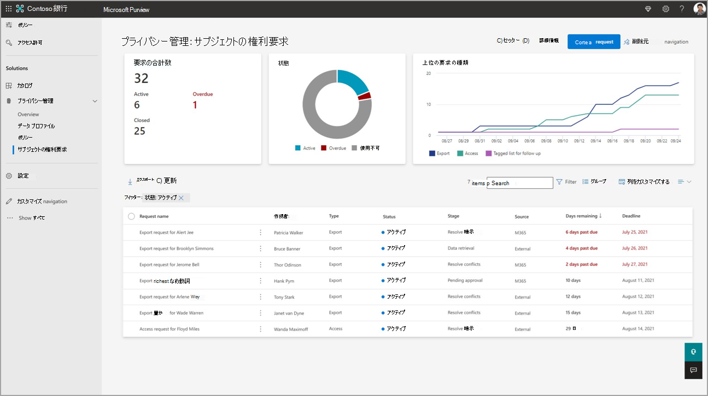

# ワークフローと要求の詳細ページを理解する

**この記事では**、要求を作成して処理する際の進行状況の手順について説明します。 各要求の詳細ページで分析情報と機能を操作する方法について説明します。

Subject Rights Requests ソリューションで[要求を作成](subject-rights-requests-create.md)すると、指定した情報は、組織のMicrosoft 365環境でデータ主体に関する一致を検索するために使用されます。 一致した項目は、必要に応じて確認、含める内容の選択、情報の編集を行うために準拠しています。 複数のユーザーが、サブジェクト権利要求インターフェイス内でこれらの手順で共同作業を行うことができます。 要求の [[概要]](#overview-tab) ページには、進行状況ステージの状態と、次に実行する手順に関するガイダンスが表示されます。

## 要求の進行状況ステージ

各要求は複数のステージを通過します。 一部のステージは自動的に進行し、他のステージはファイルの確認などの特定の手順が完了すると手動で進みます。

- **データの見積もり**: データを取得する前に、Privaが検索するデータの量を見積もります。 データの量によっては、要求がデータの取得の次の段階に自動的に移動する場合と移動しない場合があります。 データを収集する前に、見積もり段階で一時停止するように要求を設定できます。詳細については、 [データの見積もりと取得](subject-rights-requests-data-retrieval.md)に関するページを参照してください。

- **データを取得** する: すべてのファイル、電子メール、チャット、画像、およびその他のコンテンツ 項目がまとめられます。 このステージが完了すると、要求はデータを確認する次のステージに自動的に移動します。 詳細については、 [データの見積もりと取得](subject-rights-requests-data-retrieval.md)に関するページを参照してください。

- **データを確認** する: コラボレーターは、収集されたすべてのデータを確認し、要求に関連するデータを決定し、ファイルの編集やケース ノートの追加などのタスクを実行します。 [サブジェクト権利要求のデータの確認](subject-rights-requests-data-review.md)の詳細について説明します。 データレビューが完了したら、次のステージに手動で進み、レポートを生成します。

- **レポートの生成**: データレビューが完了すると、ユーザーはこの手順に手動で進みます。 Privaは、データ主体と共有するデータ パッケージと、組織のレコードの内部レポートを含む最終的なレポートを生成します。 [レポートの生成](subject-rights-requests-reports.md)の詳細については、こちらを参照してください。

- **要求を閉じる**: すべての作業が完了したら、要求を閉じて完了と見なされることを示します。 要求を満たし、閉じることができるように [レポートを生成](subject-rights-requests-reports.md) する方法の詳細について説明します。

## 要求の詳細ページについて

Microsoft Purview コンプライアンス ポータルの左側のナビゲーションから **Priva 主体の権利要求** を選択して、組織によって作成された要求にアクセスし、その状態を表示します。 次に示すメインの [サブジェクト権利要求] ページのステータス カードには、アクティブ、クローズ、期限切れの要求の数と上位の要求の種類が表示されます。 ステータス カードの下の表には、組織によって作成されたすべての要求が一覧表示され、最後に作成された要求が上部に表示されます。

**サブジェクト権利要求のメイン ページ:** 

要求の詳細ページを開くには、テーブルから要求名を選択します。 ここでは、要求のプロパティ、検索結果、および要求の状態について詳しく説明します。 以下に表示される詳細ページは、見つかったファイルの管理、レポートとエクスポートの作成、要求の完了に関する作業と共同作業を行うハブになります。

**要求の詳細ページ:**

### [概要] タブ

要求の詳細ページの [ **概要** ] タブには、要求に関する詳細、現在の手順を示す進行状況インジケーター、検出されたデータに関する重要な情報が表示されます。 このページには、以下で説明する個別のステータス カードがあります。

##### 詳細

**詳細** カードには、要求の期限、作成日、説明、関連するプライバシー規制など、要求に合った基本情報が表示されます。

##### Progress

**進行状況** カードには、プロセスの各ステップ (データの見積もり、データの取得、データの確認、レポートの生成、要求の終了) が一覧表示されます。 ステップの横に青い丸が塗りつぶされている場合は、現在のステップを示します。 青い丸の内側のチェックマークは、ステップが完了していることを意味します。 空白の空の円は、ステップがまだ開始されていないことを意味します。

##### データの見積もりの概要

**データ見積もり段階** で要求が一時停止されると、[データ見積もりの](subject-rights-requests-data-retrieval.md#data-estimate)概要カードが表示されます。 検索で取得する予定のアイテムの場所と数が表示されます。

##### 見つかったアイテムの合計数

**[見つかったアイテムの合計数]** カードには、見つかったコンテンツ アイテムの数とMicrosoft 365内の場所が表示されます。

##### 確認する優先度項目

**[確認する優先度の項目]** タイルには、レビューを開始するときに優先順位を付ける必要がある項目が表示されます。 タイルには、次のカテゴリに属するアイテムの数が表示されます。
- **機密**: これらのアイテムには [、Microsoft 秘密度ラベル](/microsoft-365/compliance/sensitivity-labels) が適用されています。 たとえば、"非常に機密性の高い" ラベルが付いた Word 文書です。 
- **複数人のデータ**: これらの項目には、複数のユーザーの個人データが含まれます。 これらの項目を最終的なデータ パッケージの一部として含める場合は、ファイル内の無関係なデータを編集する必要があります。 [データの確認に関する詳細を取得します](subject-rights-requests-data-review.md)。 Privaが複数人のデータを持つアイテムを識別するには、組織で[サブジェクト権利要求のデータ照合を設定する必要があります](subject-rights-requests-data-match.md)。

**優先度項目を見つける方法:**

まず、次の手順に従って、 **データ収集された** アイテムのテーブルでビューを有効にしていることを確認します。

- [ **データ収集]** タブで、項目の一覧の上部にある **[列のカスタマイズ** ] を選択します。
- [ **列の編集]** ポップアップ ウィンドウで、[ **優先度の種類**] の横にチェックを入れる。
- **[適用]** を選択します。 アイテムの一覧に **[優先度の種類]** 列が表示されます。

優先度項目を識別し、[ **優先度の種類** ] 列を並べ替えて、同様の型をグループ化できるようになりました。

### [データ収集] タブ

検索設定に一致するすべての項目が識別されると、その項目が収集され、[データ収集] タブ **に** 表示されます。アイテムの一覧の横には、各アイテムを確認し、やり直しを行い、アイテムを要求の一部として含める、または除外するようにマークするためのプレビュー画面があります。 [データレビューとコラボレーションの手順](subject-rights-requests-data-review.md)の詳細を確認してください。

### [メモ] タブ

[ **メモ]** タブを使用すると、コラボレーターは要求に対して行われた作業に関するメモを入力できます。 これらのメモは、要求に取り組んでいるすべてのユーザーに表示されますが、最終レポートに含めたり、データ主体と共有したりすることはありません。

### [コラボレーター] タブ

[コラボレーター] タブには、収集されたデータに対して共同作業を招待されたすべてのユーザーと、要求に関連付けられているすべてのTeamsチャネルが表示されます。 要求の作成者は、コラボレーターとして自動的に一覧表示されます。 [コラボレーターの追加] コマンドを選択し、ユーザーの名前を入力して新しい **コラボレーター** を招待し、一覧から選択します。 [データ レビューのためのコラボレーションの](subject-rights-requests-data-review.md#collaboration-for-data-review)詳細を確認する

### [レポート] タブ

[ **レポート]** タブには、レポートの生成ステージに進むと自動的に生成されるすべての **レポート** が表示されます。 レポートは、データ主体と共有するためのレポートと、組織の内部使用を目的としたレポートの 2 つのカテゴリに分かれています。 [レポートの操作](subject-rights-requests-reports.md)に関する詳細を取得します。

### [履歴] タブ

[ **履歴** ] タブには、要求の最上位レベルのイベントがまとめられます。これには、進行状況ステージの変更や、含まれる項目、除外された項目、およびやり直された項目の数の集計が含まれます。

## 次の手順

最初の要求で記載する方法については、「 [サブジェクトの権利要求を作成](subject-rights-requests-create.md) する」を参照してください。

## 法的免責事項

[Microsoft Priva法的免責事項](priva-disclaimer.md)